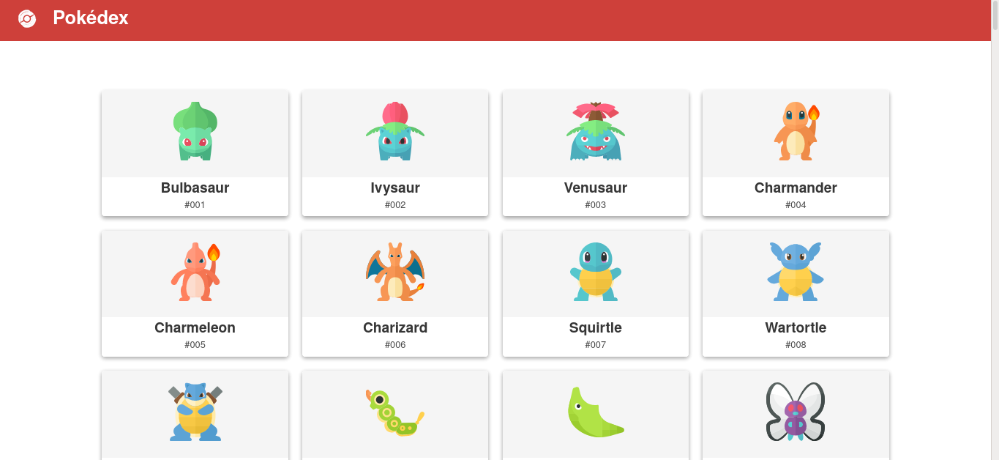
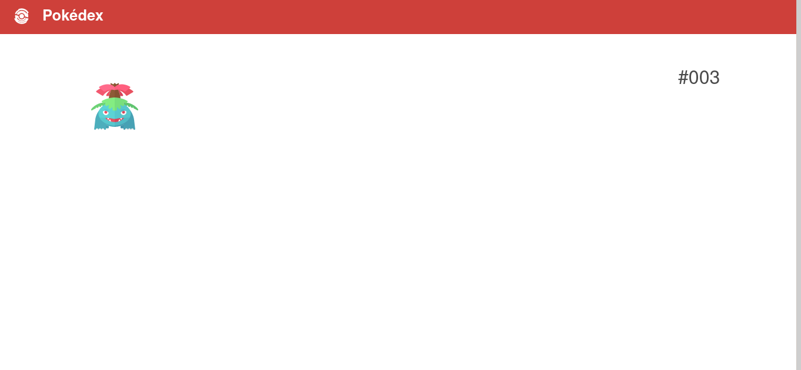

# WorkShop React - Pokédex React 

Workshop ministered na Federal University of Ceará about the react basics fundamentals 

**Pokédex React**  learning purposes 

**References** : https://github.com/magarcia/react-pokedex 


## Getting started 

```sh
git clone git@github.com:EvertonCosmo/Workshop-React-Pokedex.git
cd Workshop-React-Pokedex
npm install or yarn install 
npm start or yarn start  # open localhost:3000
```

## Screenshots 




**Feel free to send pull requests to complete and improve the application**


## Credits

Pokémon icons: [The Artificial](https://theartificial.com/pokemonicons/)

